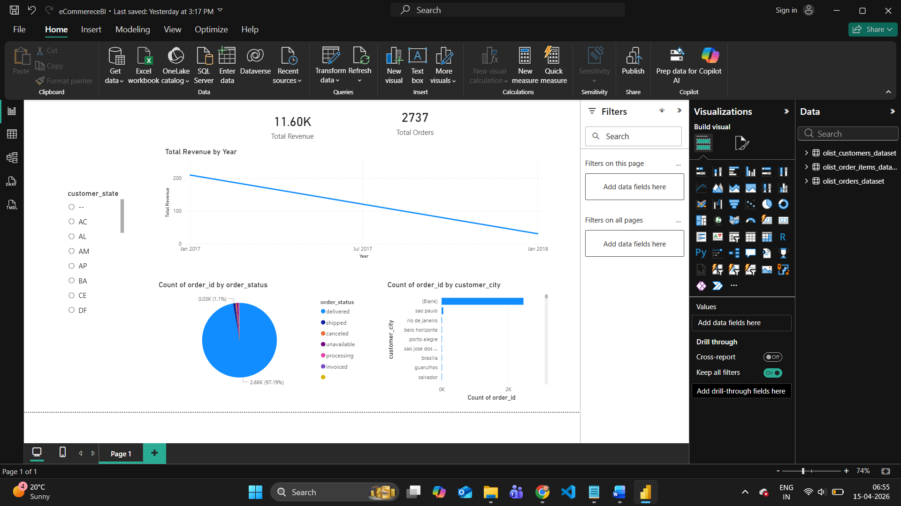

# 📊 E-commerce Sales Analysis

## 📌 Project Overview
This project analyzes an e-commerce dataset to generate insights on sales performance, customer behavior, and delivery trends.

## 🎯 Objectives
- Analyze sales trends and revenue
- Identify top-performing products and categories
- Understand customer purchasing behavior
- Evaluate delivery performance

## 🛠️ Tools & Technologies
- MySQL (Data Analysis)
- Power BI (Dashboard & Visualization)
- Excel (Data Cleaning)

## 📂 Dataset
- Brazilian E-commerce Public Dataset (Olist)

## 📊 Key Analysis (SQL)
- Revenue analysis using GROUP BY
- Customer segmentation using JOINs
- Order trends and delivery performance

## 📈 Dashboard Features
- KPI Cards: Total Revenue, Total Orders, Avg Delivery Time
- Sales trend over time
- Top categories and products
- Customer distribution

## 🔍 Key Insights
- Identified top-performing product categories
- Found seasonal sales trends
- Highlighted delivery delays affecting customer satisfaction

## 📷 Dashboard Preview

